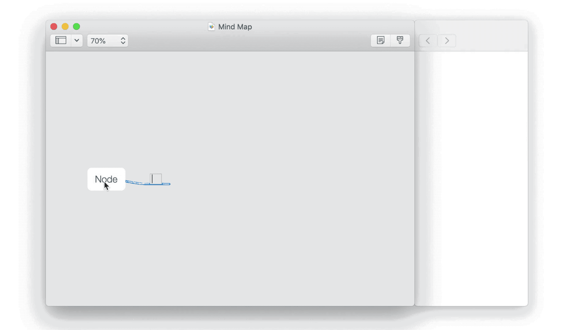

# MindNode-Tags
MindNode Tags is an extension for MindNode that adds tags and filtering. The app runs as a separate applicaiton and works by editing the xml file inside MindNode files.

I made this app as I love MindNode but wish that it had tags. This is my first Mac applicaiton. Let me know if you find it helpful.

## [Download](https://github.com/jonpdw/MindNode-Tags/releases/latest/download/MindNode_Tags_Application.zip)

## Compatability
* I have tested the app on MindNode 2.5.8 and 6.1.2. Let me know if there are any bugs in other versions

## Help

Send me a [message](https://m.me/107546807437328)

